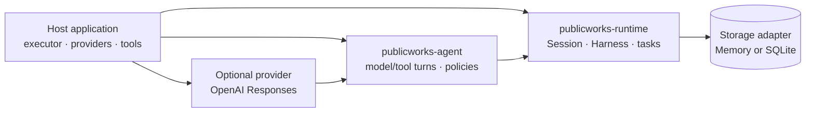

# Public Works

[](https://github.com/claytercek/publicworks/actions/workflows/release.yml)
[](#rust-version)

Public Works is an embeddable Rust runtime for durable conversations, tasks, and
model/tool turns. It stores progress at explicit checkpoints so a host can resume
interrupted work without depending on one async executor or model provider.

> **Experimental:** Public Works is `0.1` software. Public APIs, persisted records,
> checkpoint formats, and adapter schemas may change between releases.

## Who is this for?

Public Works is for developers building Rust applications that need work to
survive process restarts: agent backends, long-running workflows, background
jobs, and automation that combines model requests with local tools. It is useful
when the host needs to own the executor, model provider, storage policy, and
external side effects while still getting durable checkpoints and recovery.

It is not a complete agent application, hosted workflow service, job queue, or
sandbox. Public Works does not choose an executor, spawn background threads,
provide authorization, or make external effects exactly once.

## How it fits together

The host owns the application boundary. Public Works supplies the durable state
and scheduling primitives inside it:



A model request or tool call is first represented in durable state. The host
then polls the runtime and supplies the executable model and tool callbacks.
After a restart, the host installs those callbacks again and resumes the
pending work explicitly. See the [runtime architecture and examples](runtime/)
and the [agent turn example](agent/examples/agent_turn.rs).

## Crates

| Package | Purpose | Documentation |
| --- | --- | --- |
| [`publicworks-runtime`](https://crates.io/crates/publicworks-runtime) | Executor-neutral sessions, durable task trees, submissions, and in-memory storage | [API docs](https://docs.rs/publicworks-runtime) · [Source](runtime/) |
| [`publicworks-storage-sqlite`](https://crates.io/crates/publicworks-storage-sqlite) | Bundled SQLite storage for one logical owner | [API docs](https://docs.rs/publicworks-storage-sqlite) · [Source](storage/sqlite/) |
| [`publicworks-agent`](https://crates.io/crates/publicworks-agent) | Provider-neutral durable model/tool turns and extension hooks | [API docs](https://docs.rs/publicworks-agent) · [Source](agent/) |
| [`publicworks-provider-openai`](https://crates.io/crates/publicworks-provider-openai) | Optional non-streaming OpenAI Responses adapter | [API docs](https://docs.rs/publicworks-provider-openai) · [Source](providers/openai/) |

Most agent applications use the runtime, agent, and one storage adapter. Add the
OpenAI provider only when the host sends requests to OpenAI.

## Installation

A durable agent with SQLite storage uses these dependencies:

```toml
[dependencies]
futures-lite = "2"
publicworks-runtime = "0.1"
publicworks-storage-sqlite = "0.1"
publicworks-agent = "0.1"
```

Add the OpenAI adapter when needed:

```toml
publicworks-provider-openai = "0.1"
tokio = { version = "1", features = ["rt", "macros", "net", "io-util", "time"] }
```

The crates can also be added with Cargo:

```sh
cargo add publicworks-runtime publicworks-storage-sqlite publicworks-agent
cargo add publicworks-provider-openai
```

## Open a durable session

The following program creates or opens a SQLite database, appends one entry, and
shuts the session down cleanly:

```rust
use futures_lite::future::{block_on, zip};
use publicworks_runtime::{EntryDraft, Session, SessionError};
use publicworks_storage_sqlite::SqliteStorage;
use std::error::Error;

fn main() -> Result<(), Box<dyn Error>> {
    let storage = SqliteStorage::open("publicworks.db")?;

    block_on(async move {
        let (session, driver) = Session::new(storage);
        let commands = async {
            let receipt = session
                .commit(|tx| Box::pin(async move {
                    let conversation = tx.create_conversation().await?;
                    tx.append_entry(conversation.id, EntryDraft::new("example"))
                        .await
                }))
                .await?;

            session.close().await?;
            Ok::<_, SessionError>(receipt.value)
        };

        let (entry, ()) = zip(commands, driver).await;
        println!("stored entry {}", entry?.id);
        Ok::<_, SessionError>(())
    })?;

    Ok(())
}
```

`Session::new` returns a handle and a driver future. The host must keep the driver
polled while commands run and until `Session::close` completes. Public Works does
not spawn an executor, and its futures do not need to be `Send`.

For durable task execution, start with the
[`publicworks-runtime` examples](runtime/examples/) and the
[`Harness` documentation](https://docs.rs/publicworks-runtime/latest/publicworks_runtime/struct.Harness.html).

## Run durable agent turns

`publicworks-agent` adds checkpointed model requests, local tools, recovery
policies, and lifecycle hooks. The host supplies a model implementation and tools,
then opens a runtime `Harness` with the definitions returned by the agent.

The [complete agent example](agent/examples/agent_turn.rs) uses a deterministic
local model and tool, so it needs no network access or credentials. The
[tool policy example](agent/examples/tool_policy.rs) shows how a host can inspect
or rewrite tool calls before execution.

`publicworks-provider-openai` implements the agent's model interface for the
OpenAI Responses API. It uses asynchronous I/O and must be polled inside a Tokio
runtime. See the [provider guide](providers/openai/README.md) for configuration,
supported response types, and credential handling.

## Recovery and side effects

Task handlers commit progress through the runtime. External effects happen outside
the storage transaction. A crash can therefore leave an effect completed without
a matching durable result.

Agent tools default to `ReplayPolicy::Unsafe`. If execution was interrupted after
its intent was stored, recovery records an uncertain-effect error instead of
running the tool again. Use `ReplayPolicy::Safe` only when repeating the stored
arguments is acceptable. Public Works does not provide exactly-once external I/O.

The built-in storage implementations assume one logical owner. The SQLite adapter
does not provide a multi-process ownership lock and performs synchronous database
work when polled.

## Compatibility and limits

The `0.1` release line has no migration guarantee for stored records, task
checkpoints, agent checkpoints, definition versions, or SQLite schemas. Review the
crate release notes before upgrading an application with unfinished durable work.

Public Works does not provide authorization, sandboxing, forced cancellation,
timers, multi-process coordination, or automatic schema migration. Model
streaming, media, reasoning-state replay, and server-side conversation state are
outside the current OpenAI adapter's scope.

## Origins and inspiration

Public Works was inspired by [`@earendil-works/pi-durable`](https://github.com/earendil-works/pi/tree/main/packages/durable), an experimental TypeScript durable agent harness. In particular, it builds on the idea that conversations, model turns, tool calls, and task progress should be committed before they are treated as visible or complete, so interrupted work can be reopened and resumed.

Public Works is an independent Rust implementation with different APIs,
storage contracts, runtime boundaries, and supported feature set. The upstream
project remains the clearest reference for the original durable-agent design
that motivated this project.

## Rust version

Public Works supports Rust 1.88 and newer. The workspace uses Rust 2024 edition.
A future release may raise the minimum supported Rust version in a minor release
while the project remains below `1.0`.

## Project policies

See [CONTRIBUTING.md](CONTRIBUTING.md) to build and test the workspace. Report
security issues through the process in [SECURITY.md](SECURITY.md).

## License

Licensed under either [MIT](LICENSE-MIT) or [Apache-2.0](LICENSE-APACHE), at your
option.
